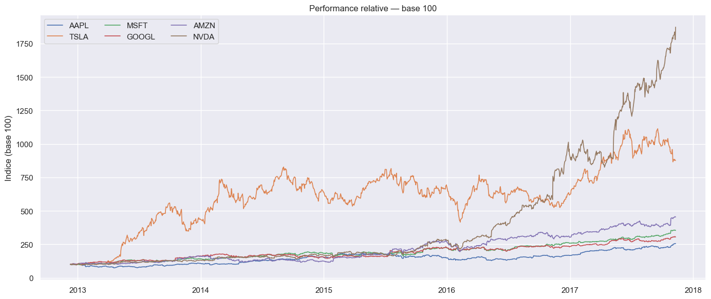
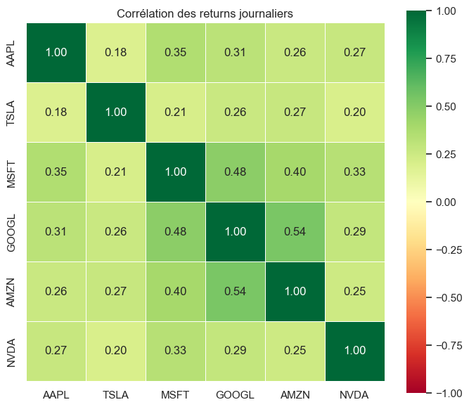

# QuantMind — Plateforme d'analyse financière par intelligence artificielle

**Projet AI & Big Data — Sujet 20 : Plateforme d'analyse financière (crypto/stocks)**

Encadrant : Dr TCHAYE-KONDI Jude

Équipe :
- **OKOUAMSSOU Kodjo** — Data & ML Engineer
- **DEGBOE Ekoué Mawuedem Jeïel** — RL Engineer & Backend Developer
- **NUTSUDJEN komi Igor** — Frontend Developer & DevOps

Dépôt GitHub : https://github.com/Skwiz-blip/Plateforme-d-analyse-financi-re

Date : Mai 2026

---

## 1. Introduction

### 1.1 Contexte

Les marchés financiers génèrent chaque jour un volume considérable de données : prix
d'ouverture et de clôture, volumes échangés, plus hauts et plus bas. Les acteurs du
trading cherchent depuis longtemps à exploiter ces historiques pour anticiper les
mouvements futurs. Les approches classiques reposent sur l'analyse technique manuelle
(lecture d'indicateurs comme le RSI ou le MACD), ce qui demande du temps, de
l'expérience, et reste sujet aux biais humains.

L'apprentissage automatique offre une alternative : des modèles capables d'apprendre
des régularités dans les séries de prix, et des agents capables de prendre des
décisions d'investissement de manière systématique, sans émotion.

### 1.2 Problématique métier

La question à laquelle notre système répond est double :

1. **Prédiction** : à partir de l'historique récent d'une action, peut-on anticiper
   son évolution à court terme (le lendemain) mieux qu'une règle naïve ?
2. **Décision** : connaissant cette anticipation, *que faut-il faire* — acheter,
   vendre, ou attendre — compte tenu de son capital, de sa position actuelle et des
   frais de transaction ?

Ces deux questions sont de natures différentes. La première est un problème de
prédiction de série temporelle. La seconde est un problème de décision séquentielle :
la meilleure action ne dépend pas seulement du marché, mais aussi de l'état du
portefeuille de l'investisseur. C'est ce constat qui a structuré toute notre
architecture : un modèle pour prédire, un agent pour décider.

### 1.3 Objectifs

- **Prédiction** — un **LSTM** anticipe le rendement du lendemain
- **Stratégie** — un **agent PPO**  traduit cette prédiction,
  combinée à l'état du portefeuille, en décisions d'achat/vente/attente

Ces deux modèles s'insèrent dans un **système
complet** de bout en bout :

- un **pipeline de données** : ingestion du dataset Kaggle, nettoyage, calcul de
  10 indicateurs techniques, et un **flux temps réel simulé via Kafka** ;
- les deux **modèles d'IA** ci-dessus, entraînés et évalués rigoureusement ;
- une **API REST** qui sert les modèles ;
- une **application web** : un dashboard de trading interactif avec un mode temps réel ;
- un **déploiement reproductible** : cinq services orchestrés par docker-compose,
  le tout démarrant en une seule commande.

---

## 2. Description des données

### 2.1 Source

Nous utilisons le dataset Kaggle *« Huge Stock Market Dataset »* de Boris Marjanovic :

> https://www.kaggle.com/datasets/borismarjanovic/price-volume-data-for-all-us-stocks-etfs

Il contient l'historique journalier (Open, High, Low, Close, Volume) de plus de
7 000 actions et ETF américains, jusqu'à novembre 2017. Parmi cet univers, nous avons
retenu six valeurs technologiques liquides et bien connues : **AAPL, MSFT, GOOGL,
AMZN, TSLA et NVDA**. Pour chaque ticker, nous conservons les cinq dernières années
disponibles (environ 1 250 jours de bourse par titre après nettoyage).

### 2.2 Analyse exploratoire (EDA)

L'analyse exploratoire complète est disponible dans le notebook `eda.ipynb` du dépôt.
Les principaux constats :

- **Pas de valeurs manquantes** dans les colonnes OHLCV du dataset d'origine, mais
  quelques lignes avec un volume nul (jours fériés partiels) que nous filtrons.
- **Non-stationnarité des prix** : sur cinq ans, le prix d'AAPL passe d'environ 80 à plus de 170$. La moyenne et la variance de la série évoluent dans le temps —
  ce constat, vérifié sur les six titres, aura une conséquence directe sur le choix
  de la cible de notre modèle
  
- **Quasi-stationnarité des rendements journaliers** : centrés autour de 0, écart-type
  de l'ordre de 1 à 2 % selon le titre, distribution leptokurtique (queues épaisses)
  typique des séries financières.
  
- **Corrélations** : les EMA sont très corrélées au prix (attendu) ; le RSI et le
  ratio de volume apportent une information plus indépendante.
  

### 2.3 Préparation et feature engineering

À partir des données OHLCV brutes, nous calculons dix variables d'entrée :

| Feature | Rôle |
|---|---|
| Close, Volume | Données de base |
| EMA 20, EMA 50 | Tendances court et moyen terme lissées |
| RSI (14) | Niveau de surachat/survente |
| MACD, MACD signal | Momentum et retournements |
| Largeur des bandes de Bollinger | Volatilité relative |
| ATR (14) | Volatilité absolue |
| Ratio de volume (vs moyenne 20 j) | Activité anormale |

Les premières lignes (fenêtres de calcul incomplètes) sont supprimées. Les données
transformées sont stockées dans `data/processed/{TICKER}.csv` — ce sont elles qui
alimentent l'entraînement, l'API et le flux Kafka.


## 3. Architecture du système

### 3.1 Schéma global

```
                        ┌────────────────── Conteneurs Docker ──────────────────────┐
                        │                                                           │
  Données Kaggle        │   ┌────────────┐      ┌─────────────┐                     │
  (CSV OHLCV)  ─────────┼──►│  PRODUCER  │─────►│    KAFKA    │   topic `prices`    │
                        │   │  (replay   │      │  (apache/   │                     │
   data/processed/      │   │  tick/tick)│      │ kafka 3.7,  │                     │
        ▲               │   └────────────┘      │   KRaft)    │                     │
        │               │                       └──────┬──────┘                     │
   ┌────┴─────┐         │                              │                            │
   │ train.py │         │                       ┌──────▼──────┐                     │
   │ pipeline │         │                       │  CONSUMER   │  LSTM → r̂ (%)      │
   │ d'entraî-│         │                       │ (scoring +  │  PPO  → action      │
   │ nement   │         │                       │   paper     │  + probabilité      │
   └────┬─────┘         │                       │  trading)   │                     │
        │               │                       └──────┬──────┘                     │
        ▼               │                              │  topic `signals`           │
   models/              │                       ┌──────▼──────┐      ┌──────────┐   │
   lstm_*.keras  ───────┼──────────────────────►│ API FastAPI │─────►│ FRONTEND │───┼──► Utilisateur
   scaler_*.pkl         │                       │  /predict   │ HTTP │  React + │   │   (navigateur)
   ppo_*.zip            │                       │  /strategy  │ JSON │ Recharts │   │
                        │                       │  /live/*    │      │ (nginx)  │   │
                        │                       └─────────────┘      └──────────┘   │
                        └───────────────────────────────────────────────────────────┘

  Entraînement (hors ligne) :  CSV → indicateurs → LSTM → PPO → models/
  Inférence batch (API)     :  CSV + modèles → prédictions, signaux, backtests
  Inférence temps réel      :  producer → Kafka → consumer → signals → API → onglet Live
```

### 3.2 Pipeline de données : batch et streaming

Notre pipeline a deux régimes, conformément à la distinction batch/streaming vue en
cours :

- **Batch** : `train.py` charge les CSV Kaggle, calcule les indicateurs et entraîne
  les modèles. C'est le chemin « photo du passé » — tolérant à la latence.
- **Streaming** : un *producer* rejoue l'historique tick par tick (un tick = un jour
  de bourse, cadence configurable) vers le topic Kafka `prices`. Un *consumer*
  maintient une fenêtre glissante de 60 jours par ticker, score chaque tick avec les
  deux modèles et publie le signal enrichi (action, confiance, portefeuille virtuel)
  sur le topic `signals`. L'API expose ces signaux et le dashboard les affiche en
  direct. C'est le chemin « vidéo du présent ».

### 3.3 Choix des outils

| Brique | Outil | Justification |
|---|---|---|
| Ingestion temps réel | **Kafka** (apache/kafka 3.7, mode KRaft) | bus de messages standard ; le cas d'usage trading est intrinsèquement un cas streaming |
| Modèle séquentiel | **TensorFlow / Keras (LSTM)** | référence pour les séries temporelles |
| Agent de décision | **stable-baselines3 (PPO)** + Gymnasium | implémentation éprouvée, environnement custom |
| API | **FastAPI** | rapide, typage, documentation Swagger automatique |
| Application | **React + Recharts** (sans build, via Babel) | dashboard riche, léger à déployer (nginx) |
| Déploiement | **Docker / docker-compose** | cinq services, une commande |

Nous avons volontairement **écarté Spark et Hadoop**. Notre volume utile — six
tickers d'environ 1 250 lignes chacun — tient sans difficulté en mémoire, et le
cours nous a mis en garde : Spark sur quelques milliers de lignes est plus lent que
pandas. Le choix Big Data doit se justifier par le volume réel ; ici, la brique
« passage à l'échelle » pertinente était le streaming (Kafka), pas le calcul
distribué. Un traitement Spark des 7 000 tickers complets du dataset reste une
extension envisageable (section 8).

À noter : l'image `bitnami/kafka` montrée en cours étant dépréciée depuis 2025, nous
utilisons l'image officielle `apache/kafka` en mode KRaft (sans Zookeeper).

---

## 4. Modélisation

### 4.1 Vue d'ensemble : prédire, puis décider

Le système couple deux modèles aux rôles distincts :

1. Le **LSTM** observe les 60 derniers jours (10 features) et prédit le **rendement
   du lendemain** — une opinion sur le marché.
2. L'**agent PPO** reçoit cette opinion *parmi* 12 variables d'observation (dont sa
   position, son capital et son P&L) et choisit une action : acheter, vendre, ou
   attendre.

Cette séparation reflète la réalité métier : savoir que le titre va probablement
monter ne suffit pas à décider — tout dépend de si l'on est déjà investi, du capital
disponible, et des frais que le mouvement coûterait.

### 4.2 Le LSTM : pourquoi nous prédisons le rendement et pas le prix

C'est le point méthodologique central du projet, et nous l'avons appris à nos dépens.

Notre **première version** prédisait directement le prix de clôture du lendemain.
Tout semblait correct : la loss diminuait, les courbes de prédiction suivaient
visuellement les prix. C'est en ajoutant une **baseline naïve** (« le prix de demain
= le prix d'aujourd'hui »), comme le recommande la méthodologie du cours, que le
problème est apparu :

| Modèle (AAPL, test set) | RMSE |
|---|---|
| Baseline naïve | **1,88 $** |
| LSTM (prix brut) | 19,29 $ |

Notre LSTM était dix fois pire qu'une règle triviale. La cause : le prix est
**non-stationnaire**. Le scaler MinMax est ajusté sur la période d'entraînement
(prix entre 80 et 130 $) ; en test, le titre vaut 174 $ et le modèle « tire » ses
prédictions vers la plage qu'il connaît (il prédisait 139 $ pour un prix réel de
174 $). Le réseau dépensait sa capacité à modéliser le *niveau* du prix — une
information déjà connue — au lieu de la *variation*, qui est la vraie inconnue.

La correction, standard en finance quantitative : **prédire le rendement journalier
en pourcentage**, qui est une grandeur stationnaire (centrée sur 0, de même échelle
en 2012 qu'en 2017), puis reconstruire le prix :

```
prix_prédit = Close_aujourd'hui × (1 + r̂ / 100)
```

Cette formulation a une propriété rassurante : si le modèle prédit r̂ = 0, on retombe
exactement sur la baseline naïve. La dérive devient mathématiquement impossible.

### 4.3 Architecture et entraînement du LSTM

- **Entrée** : fenêtre glissante de 60 jours × 10 features, normalisées par un
  MinMaxScaler ajusté **uniquement sur le train** (anti data leakage).
- **Cible** : rendement du jour suivant, en % (non normalisé : déjà stationnaire).
- **Architecture** : LSTM 128 → Dropout 0,2 → LSTM 64 → Dropout 0,2 → LSTM 32 →
  Dropout 0,2 → BatchNorm → Dense 32 (ReLU) → Dense 1. Environ 150 000 paramètres.
- **Entraînement** : Adam (lr 10⁻³), MSE, batch 32, maximum 100 epochs avec
  EarlyStopping (patience 12) et ReduceLROnPlateau. En pratique, la convergence
  intervient entre 15 et 40 epochs selon le ticker.
- **Découpage temporel strict** : 80 % train / 10 % validation / 10 % test, sans
  mélange. Le jeu de test n'est utilisé qu'une seule fois, en toute fin.

### 4.4 L'agent RL : environnement et apprentissage

Nous avons implémenté un environnement Gymnasium sur mesure (`env.py`) :

- **Actions** (3) : HOLD, BUY (investit le capital disponible, max 10 actions),
  SELL (liquide la position).
- **Observation** (12 valeurs) : prédiction LSTM rapportée au prix courant, RSI,
  MACD, EMA 20/50 (en ratios), largeur de Bollinger, ATR, ratio de volume, rendement
  de la veille, position courante, capital restant, performance cumulée.
- **Récompense** : variation relative de la valeur du portefeuille à chaque pas,
  avec une légère pénalité d'inactivité (rester 100 % cash sans jamais trader n'est
  pas une stratégie).
- **Réalisme** : frais de transaction de 0,1 % sur chaque ordre, capital initial de
  10 000 $.

L'agent est entraîné avec **PPO** (stable-baselines3) sur 500 000 pas de simulation
(lr 3·10⁻⁴, γ = 0,99, GAE λ = 0,95, coefficient d'entropie 0,01). PPO a été retenu
pour sa stabilité : ses mises à jour de politique « conservatives » conviennent bien
à un environnement bruité comme un marché financier.

Un point d'implémentation important : lorsque le LSTM n'est pas disponible, une
première version de notre code remplaçait silencieusement ses prédictions par les
prix réels. Nous avons supprimé ce repli : le pipeline s'arrête désormais avec une
erreur explicite. Un entraînement qui se dégrade en silence est un entraînement
qu'on ne peut pas interpréter.

---

## 5. Évaluation

### 5.1 Méthodologie

Chaque modèle est évalué contre des références sur **le même jeu de test** :

- le LSTM contre trois baselines : **naïve** (r̂ = 0), **momentum** (r̂ = rendement
  de la veille) et **régression linéaire** (features du dernier jour → rendement) ;
- l'agent PPO contre la stratégie **Buy & Hold** (acheter au début, ne plus toucher).

Métriques : RMSE, MAE et MAPE sur le prix reconstruit, et surtout la **précision
directionnelle** (pourcentage de jours où le signe du rendement prédit est correct),
calculée sur le signe de r̂. En trading, se tromper de 2 $ sur le niveau importe
moins que se tromper de direction. Pour l'agent : rendement total, ratio de Sharpe,
drawdown maximal, taux de trades gagnants.

### 5.2 Résultats du LSTM (les 6 tickers)

| Ticker | RMSE LSTM ($) | RMSE naïve ($) | Dir. Acc LSTM | Meilleure baseline (Dir. Acc) |
|---|---|---|---|---|
| AAPL | 1,91 | 1,88 | **56,3 %** | momentum : 47,9 % |
| TSLA | 8,08 | 7,95 | **52,1 %** | rég. linéaire : 47,1 % |
| MSFT | 0,75 | 0,76 | **57,1 %** | momentum : 47,1 % |
| GOOGL | 10,51 | 10,32 | **54,6 %** | momentum : 47,1 % |
| AMZN | 15,82 | 15,85 | 51,3 % | **momentum : 55,5 %** |
| NVDA | 3,73 | 3,78 | **57,1 %** | rég. linéaire : 56,3 % |

Lecture :

- Sur le **niveau de prix**, le LSTM fait jeu égal avec la naïve (il la bat même
  légèrement sur MSFT, AMZN et NVDA). C'est attendu et c'est sain : le prix de
  demain est dominé par le prix d'aujourd'hui.
- Sur la **direction** — l'information utile au trading — le LSTM bat toutes les
  baselines sur **cinq titres sur six**, avec 52 à 57 % de précision là où les
  références plafonnent autour de 47 %. En finance, quelques points au-dessus de
  50 % suffisent à construire une stratégie, à condition de gérer les frais.

### 5.3 Analyse d'erreur : le cas AMZN

Sur AMZN, la baseline momentum (55,5 %) bat notre LSTM (51,3 %). Plutôt que de
l'ignorer, nous l'avons analysé : la période de test d'AMZN correspond à une
tendance haussière forte et régulière, un régime où « demain continuera comme
aujourd'hui » est une règle difficile à battre. Le LSTM, entraîné sur des régimes
plus variés, ne fait pas mieux qu'une règle de suivi de tendance sur cette fenêtre
précise. C'est une limite connue des modèles appris : leur avantage dépend du régime
de marché. Ce constat plaide pour un réentraînement périodique et, à terme, pour des
features de contexte de marché (indice global, volatilité implicite).

### 5.4 Résultats de l'agent RL vs Buy & Hold

Backtest sur les 20 % de données de test (jamais vues à l'entraînement), frais de
0,1 % inclus, capital initial 10 000 $. Pour chaque titre, on compare l'agent PPO à
la stratégie passive Buy & Hold sur les trois dimensions qui comptent : le rendement
brut, le rendement ajusté au risque (Sharpe) et le risque maximal subi (drawdown).

| Ticker | Rendement RL | Rendement B&H | Sharpe RL | Sharpe B&H | Drawdown RL | Drawdown B&H | Trades RL |
|---|---|---|---|---|---|---|---|
| AAPL  | +6,04 %  | +61,11 % | 2,52 | 2,94 | **−1,32 %** | −8,86 %  | 1 |
| TSLA  | +13,75 % | +64,29 % | **1,85** | 1,61 | **−3,59 %** | −22,27 % | 13 |
| MSFT  | +2,52 %  | +42,89 % | 2,53 | 2,59 | **−0,43 %** | −6,00 %  | 1 |
| GOOGL | +26,34 % | +31,70 % | 1,99 | 2,01 | **−6,93 %** | −8,45 %  | 1 |
| AMZN  | +37,81 % | +49,25 % | 2,04 | 2,08 | **−8,75 %** | −10,85 % | 1 |
| NVDA  | +12,41 % | +136,18 %| 2,31 | 2,31 | **−2,28 %** | −19,74 % | 1 |

Lecture honnête de ces résultats :

- **Le Buy & Hold gagne en rendement brut sur les six titres.** Ce n'est pas une
  surprise : la période de test (2016-2017) est l'une des plus haussières de la
  décennie, en particulier pour NVDA (+136 %). Quand un actif ne fait que monter,
  rester investi en permanence est imbattable en rendement pur — par construction.
- **Mais l'agent réduit systématiquement le risque.** Sur les six titres, le drawdown
  maximal de l'agent est plus faible que celui du Buy & Hold, souvent de façon
  spectaculaire : −2,28 % contre −19,74 % sur NVDA, −3,59 % contre −22,27 % sur TSLA.
  L'agent a appris à se mettre à l'abri (rester en cash) dans les phases incertaines,
  ce qui est exactement le comportement attendu d'une gestion du risque.
- **TSLA est le cas où l'agent est globalement supérieur** : il bat le Buy & Hold à la
  fois en Sharpe (1,85 vs 1,61) et en drawdown, avec 13 trades dont 66,7 % gagnants.
  C'est le titre le plus volatil de l'échantillon — précisément là où savoir entrer
  et sortir crée de la valeur, alors que sur un titre qui monte en ligne droite,
  trader ne fait qu'ajouter des frais.
- **Le win rate de 0 % sur cinq titres est un artefact, pas un échec** : l'agent a
  ouvert une seule position et l'a conservée jusqu'à la fin (1 trade). Comme aucune
  paire achat→vente n'est bouclée, le calcul du win rate par paires renvoie 0 — alors
  que la position est en réalité gagnante (rendement positif). Sur TSLA, où l'agent
  boucle réellement 13 trades, le win rate de 66,7 % est, lui, significatif.

En résumé : sur un marché unilatéralement haussier, notre agent privilégie la
préservation du capital au rendement maximal. Il « laisse de l'argent sur la table »
en échange d'une exposition au risque drastiquement réduite. C'est un compromis
défendable — un investisseur réel ne sait pas, lui, qu'il traverse un marché
haussier — mais qui plaide pour évaluer le système sur une période incluant aussi des
phases baissières (cf. section 8).

---

## 6. Déploiement

### 6.1 L'API

L'API FastAPI (`api.py`) charge tous les artefacts (modèles Keras, scalers, agents
PPO) **une seule fois au démarrage** puis sert :

| Endpoint | Rôle |
|---|---|
| `GET /health`, `GET /tickers` | supervision, liste des modèles disponibles |
| `GET /data`, `GET /data/summary` | historiques et indicateurs |
| `GET /predict?ticker=&days=` | prévision LSTM multi-jours (rendements → prix reconstruits) |
| `GET /strategy?ticker=` | signaux BUY/SELL/HOLD avec la **probabilité réelle** issue de la policy PPO |
| `GET /performance`, `/performance/portfolio` | backtest RL vs Buy & Hold |
| `GET /model/info` | architecture, hyperparamètres, métriques |
| `GET /live/status`, `GET /live/signals` | flux temps réel (lecture du topic Kafka `signals`) |

Les erreurs sont explicites : 404 pour un ticker inconnu, 503 si les modèles d'un
ticker ne sont pas entraînés. Détail dont nous ne sommes pas peu fiers : la
« confiance » d'un signal n'est pas une valeur décorative, c'est la probabilité de
l'action lue dans la distribution de la politique PPO.

Une optimisation a été nécessaire en cours de route : la génération des prédictions
appelait initialement le modèle une fois par jour d'historique (environ 190 appels
TensorFlow par requête, soit 30 à 60 secondes). En regroupant toutes les fenêtres
dans un unique appel batché, la même requête prend environ 3 secondes — indispensable
pour une démonstration fluide.

### 6.2 L'application web

Le dashboard (React + Recharts, servi par nginx) comporte six vues : Guide,
Dashboard (prix réel + prédiction LSTM, RSI, MACD, signaux), **Live** (flux Kafka en
direct : décisions de l'agent, confiance, portefeuille virtuel), Modèle
(architecture et hyperparamètres), Performance (RL vs Buy & Hold, distribution des
rendements) et Données (exploration, export CSV). L'application permet de tester le
modèle, visualiser les résultats et interagir avec le système — les trois exigences
du cahier des charges.

### 6.3 Docker : tout démarre en une commande

```bash
docker compose up --build
```

Cinq services : `kafka` (apache/kafka 3.7, KRaft, healthcheck), `producer`,
`consumer`, `backend` (port 8000) et `frontend` (port 8080). Les dépendances sont
ordonnées (le producer et le consumer attendent que Kafka soit *healthy*), les
modèles et données sont montés en volumes, et l'ensemble fonctionne hors ligne.

---

## 7. Démonstration du système

Scénario de démonstration:

1. `docker compose up --build`, puis ouvrir http://localhost:8080.
2. **Dashboard** : choisir un ticker, observer le prix réel, l'EMA, la prévision
   LSTM à 14 jours et les derniers signaux de l'agent avec leur confiance.

   

3. **Live** : l'onglet affiche les ticks qui arrivent du producer via Kafka, la
   décision de l'agent à chaque tick (avec sa probabilité), et l'évolution du
   portefeuille virtuel de 10 000 $ en paper trading.

   

4. **Performance** : comparaison agent RL vs Buy & Hold (courbes de portefeuille,
   Sharpe, drawdown).

   

5. la documentation interactive de l'API sur
   http://localhost:8000/docs.

Cas d'usage métier : un analyste peut vérifier en quelques secondes ce que le
système « pense » d'un titre (direction prévue, force du signal), confronter la
stratégie apprise à une stratégie passive, et auditer les décisions une par une —
chaque signal est daté, prixé et accompagné de sa probabilité.

---

## 8. Limites et améliorations

### Limites assumées

1. **Données arrêtées à novembre 2017** : le mode temps réel rejoue l'historique, il
   ne reflète pas le marché du jour.
2. **Prévision multi-jours simplifiée** : dans `/predict`, seul le prix est mis à
   jour de manière autorégressive ; les indicateurs techniques de la fenêtre restent
   figés. Fiable à quelques jours, dégradé au-delà.
3. **Régimes de marché** : entraîné sur 2012-2017 (marché plutôt haussier), le
   système n'a jamais « vu » de krach. Le cas AMZN (section 5.3) illustre cette
   sensibilité au régime.
4. **Mono-actif** : l'agent gère un titre à la fois ; pas d'allocation de
   portefeuille multi-actifs.
5. **Microstructure ignorée** : pas de slippage, pas de carnet d'ordres, exécution
   supposée au prix de clôture.

### Améliorations envisagées

- **Ingestion de données récentes** (yfinance) en job batch séparé, avec
  recalage des splits d'actions, ce qui ouvrirait aussi les crypto-monnaies
  (BTC, ETH) absentes du dataset Kaggle.
- **Features de contexte de marché** : rendement de l'indice S&P 500, VIX — pour
  aider le modèle à distinguer « mon titre baisse » de « tout le marché baisse ».
- **Job Spark batch** sur les ~7 000 tickers du dataset complet (~2 Go) : calcul
  distribué des indicateurs et screening multi-titres — là, le volume justifierait
  l'outil.
- **Cible alternative en classification** (hausse/baisse) à comparer à la
  régression de rendement ; **modèles de type Transformer** pour les séquences.
- **Gestion du risque enrichie** : stop-loss appris, dimensionnement de position
  fonction de l'ATR.

---

## 9. Répartition du travail

Projet réalisé en équipe de trois, avec des rôles définis dès le départ et un
dépôt Git commun. Les intégrations (LSTM ↔ RL, API ↔ frontend, Kafka ↔ tous) ont
été faites en binôme lors de séances de travail communes.

### OKOUAMSSOU Kodjo — Data & ML Engineer

- Acquisition et exploration du dataset Kaggle ; notebook d'EDA (`eda.ipynb`) :
  distributions, stationnarité, corrélations, choix des features.
- Pipeline de préparation (`train.py`, partie 1) : chargement, nettoyage, calcul
  des 10 indicateurs techniques (`compute_indicators`), sauvegarde des CSV traités.
- Conception et entraînement du LSTM (partie 2) : séquences glissantes, découpage
  temporel 80/10/10, normalisation anti-leakage, architecture 128-64-32, callbacks.
- Refonte de la cible prix → rendement après le diagnostic de non-stationnarité,
  et mise en place du protocole d'évaluation : les trois baselines, les métriques,
  les tableaux comparatifs de la section 5.
- Producer Kafka (`streaming/producer.py`) : rejeu de l'historique en flux.

### DEGBOE Ekoué Mawuedem Jeïel — RL Engineer & Backend Developer

- Environnement de trading Gymnasium (`env.py`) : espaces d'actions et
  d'observations, fonction de récompense, frais de transaction, contraintes de
  position.
- Entraînement de l'agent PPO (`train.py`, partie 3) : hyperparamètres, callbacks
  d'évaluation, couplage avec les prédictions LSTM.
- Backtesting et métriques financières : Sharpe, drawdown maximal, win rate,
  comparaison systématique au Buy & Hold.
- API FastAPI (`api.py`) : les endpoints, le chargement des modèles au démarrage
  (lifespan), la gestion d'erreurs, le calcul des probabilités réelles de la policy,
  l'optimisation des prédictions batchées ; tests manuels via Swagger.
- Consumer Kafka (`streaming/consumer.py`) : scoring temps réel, paper trading,
  publication des signaux ; endpoints `/live/*`.

### NUTSUDJEN komi Igor — Frontend Developer & DevOps

- Dashboard React + Recharts (`frontend/index.html`) : vues Dashboard (prix +
  prédiction LSTM, RSI, MACD, signaux), Performance (portefeuille RL vs Buy & Hold,
  distribution des rendements), Données (filtre, export CSV), Modèle, Guide.
- Onglet **Live** : polling des signaux Kafka via l'API, graphiques temps réel,
  table des décisions avec confiance.
- Dockerisation complète : Dockerfile du backend (installation par couches pour
  résister aux coupures réseau), Dockerfile du frontend (nginx), `docker-compose.yml`
  à cinq services avec healthchecks et dépendances ordonnées ; migration de l'image
  Kafka dépréciée (bitnami) vers l'image officielle Apache.
- README (installation, exécution, dépannage) et préparation de la démonstration.

---

## Conclusion

Ce projet nous a fait toucher du doigt ce que « construire un système d'IA » veut
réellement dire : le modèle n'est qu'une brique parmi d'autres, et pas forcément la
plus difficile. Notre plus grande leçon est méthodologique — sans baseline, notre
premier LSTM semblait fonctionner alors qu'il était dix fois pire qu'une règle
triviale. C'est la comparaison honnête, exigée par la démarche du cours, qui a
révélé le problème et orienté la correction (prédire le rendement plutôt que le
prix). Le résultat est un système complet, reproductible en une commande, qui
prédit la direction du marché mieux que le hasard et que ses baselines sur cinq
titres sur six, décide en tenant compte des frais et du capital, et expose le tout
dans un dashboard temps réel alimenté par Kafka.
